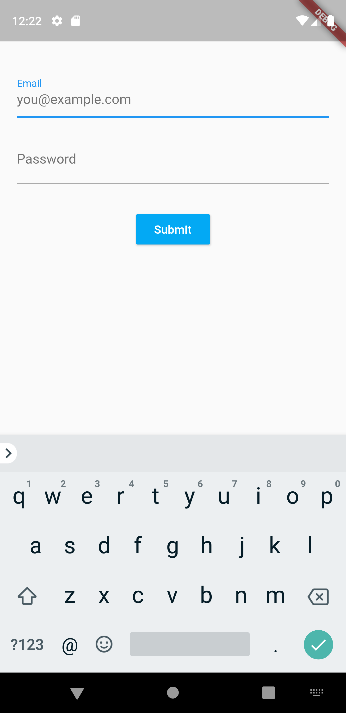
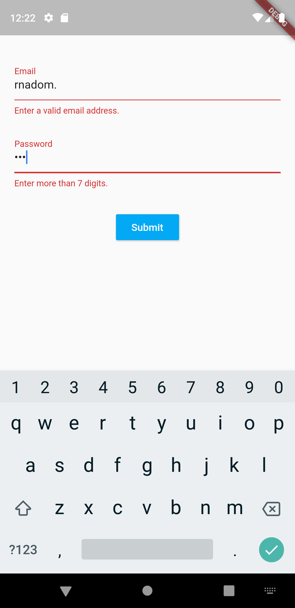

# Login Screen
Created a new flutter project that has a Login Screen. Created a Stateful Widget for the screen and used, Form, FormState, TextFormField, RaisedButton and many more widgets. Created a form validator too.

## Flutter Concetps
- Ability to handle form inputs.
- Ability to validate form inputs and reflect in the UI.
- Using mixins to create re usable code.

## Screenshots

